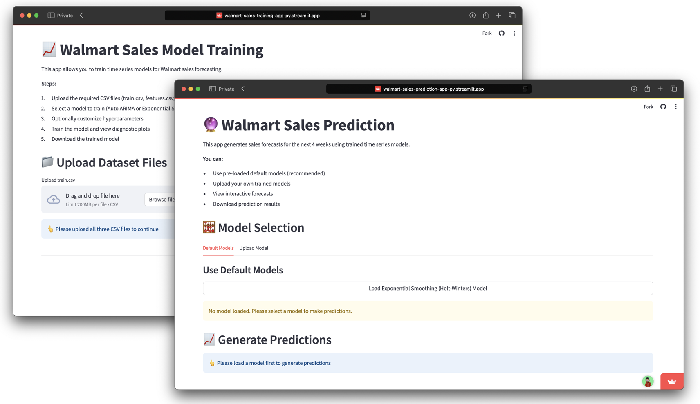

# Walmart Sales Forecasting Web Applications




**Time Series Forecasting System for Walmart Sales Prediction**


**Supervisor:** Prof. Dr. Elmar Wings
**University:** University of Applied Sciences Emden/Leer
**Course:** Master's Business Analytics
**Submission Date:** June 30, 2025

## Project Overview

The Walmart Sales Forecasting System is a comprehensive dual-application solution that demonstrates advanced time series forecasting capabilities using state-of-the-art machine learning algorithms. This system predicts weekly sales changes for retail environments across 45 Walmart stores and 81 departments, providing a complete forecasting workflow from model development to production predictions.

## Directory Structure

The project repository is organized as follows:

| Directory/File | Description |
|----------------|-------------|
| [Code](./Code/) | Contains all scripts for data preprocessing, analysis, and forecasting. |
| [Documents](./Documents/) | Includes supporting documents such as literature reviews and references. |
| [Manual](./Manual/) | User manual for understanding and utilizing the project deliverables. |
| [Poster](./Poster/) | Project poster summarizing key findings and methodology. |
| [Presentations](./Presentations/) | Slide decks for project presentations. |
| [ProjectManagement](./ProjectManagement/) | Contains files related to task management, timelines, and milestones. |
| [report](./report/) | Final report detailing the methodology, results, and conclusions. |
| [.gitignore](./.gitignore) | Specifies intentionally untracked files to ignore in the Git repository. |
| [README.md](./README.md) | This file provides an overview of the project structure and usage. |
| [author.xlsx](./author.xlsx) | Spreadsheet containing author details and contributions. |

The project report repository is organized as follows:

[report](./report/)
- Report PDF: [WalmartSalesForecastingReportPDF](./report/WalmartSalesForecastingReport.pdf)
- Main tex file: [WalmartSalesForecastingReport](./report/WalmartSalesForecastingReport.tex)


The Literature repository is located as follows:

[Literature](./Documents/)
- MyLiterature bib file: [MyLiteratureBib](./Documents/MyLiterature.bib)
- Literature Review PDF: [WalmartSalesForecastingLiteraturePDF](./Presentations/Literature/WalmartSalesForecastingLiterature.pdf)
- Literature Review tex file: [WalmartSalesForecastingLiterature](./Presentations/Literature/WalmartSalesForecastingLiterature.tex)

Our Final Project Presentation is located as follows:

- Project Presentation PDF: [WalmartSalesForecastingPresentationsPDF](./Presentations/WalmartSalesForecastingPresentations/WalmartSalesForecastingPresentations.pdf)
- Project Presentation Tex file: [WalmartSalesForecastingPresentations](./Presentations/WalmartSalesForecastingPresentations/WalmartSalesForecastingPresentations.tex)

The Poster is located as follows:

- Poster PDF: [WalmartSalesForecastingPosterPDF](./Poster/WalmartSalesForecastingPoster.pdf)
- Poster Tex file: [WalmartSalesForecastingPoster](./Poster/WalmartSalesForecastingPoster.tex)

The Manual is located as follows:

- Manual PDF: [WalmartSalesForecastingManualPDF](./Manual/WalmartSalesForecastingManual.pdf)
- Main Tex file: [WalmartSalesForecastingManual](./Manual/WalmartSalesForecastingManual.tex)

The Code repository is organized as follows:

- WalmartSalesPredictionApp: [WalmartSalesPredictionAppPy](./Code/WalmartSalesPredictionApp/walmartSalesPredictionApp.py)
- WalmartSalesTrainingApp: [WalmartSalesTrainingAppPy](./Code/WalmartSalesTrainingApp/walmartSalesTrainingApp.py)
- WalmartSalesPredictionAppTest: [testWalmartSalesPredictionPy](./Code/WalmartSalesPredictionApp/testWalmartSalesPrediction.py)
- WalmartSalesTrainingAppTest: [walmartSalesTrainingAppPy](./Code/WalmartSalesTrainingApp/walmartSalesTrainingApp.py)
- Exploratory Data Analysis (EDA): [](./Code/abcd.ipynb)

The requirements.txt is located as follows:

- Requirements.txt file: [Requirements](./Code/WalmartSalesTrainingApp/requirements.txt)


### Key Features

- **Dual-Application Architecture**: Separate training and prediction applications for optimal workflow
- **Advanced Algorithms**: Auto ARIMA and Exponential Smoothing (Holt-Winters) implementations
- **High Accuracy**: Default model achieves 3.58% normalized WMAE (excellent performance category)
- **Flexible Deployment**: Cloud-based and local installation options
- **Interactive Interface**: Web-based GUI with real-time visualization and export capabilities
- **Production Ready**: Robust error handling, validation, and performance optimization


## System Architecture

```
┌─────────────────┐    ┌──────────────────┐    ┌─────────────────┐
│   Data Sources  │    │  Training App    │    │ Prediction App  │
│                 │───▶                   │───▶                 │
│ • train.csv     │    │ • Model Training │    │ • Forecasting   │
│ • features.csv  │    │ • Evaluation     │    │ • Visualization │
│ • stores.csv    │    │ • Export         │    │ • Results       │
└─────────────────┘    └──────────────────┘    └─────────────────┘
```

The system consists of two specialized applications:

1. **Training Application** (Port 8501): Model development, training, and evaluation
2. **Prediction Application** (Port 8502): Production forecasting with pre-trained models

## Quick Start

### Cloud Access (Recommended)

**No installation required** - Access immediately via web browser:

- **Training Application**: https://walmart-sales-training-app-py.streamlit.app/
- **Prediction Application**: https://walmart-sales-prediction-app-py.streamlit.app/

### Locally Hosted Access URLs

- Training Application: http://localhost:8501
- Prediction Application: http://localhost:8502


### Generate Your First Forecast (30 seconds)

1. Open the [Prediction Application](https://walmart-sales-prediction-app-py.streamlit.app/)
2. Click "Load Exponential Smoothing (Holt-Winters) Model"
3. Click "Generate 4-Week Forecast"
4. View interactive results and download CSV/JSON exports

## Local Installation

### Prerequisites

- **Python Version**: Exactly Python 3.12.x (required)
- **Operating System**: Windows 10+, macOS 10.15+, or Linux Ubuntu 18.04+
- **Hardware**: 4GB RAM minimum (8GB recommended), 2GB free storage
- **Network**: Internet connection for initial setup


### Installation Steps

1. **Clone the repository**

```bash
git clone <repository-url>
cd walmart-sales-forecasting
```

2. **Create virtual environment** (Python 3.12 required)

```bash
python3.12 -m venv walmart_forecast_env

# Activate environment
source walmart_forecast_env/bin/activate  # Linux/macOS
walmart_forecast_env\Scripts\activate     # Windows
```

3. **Install dependencies**

```bash
cd Code/WalmartSalesTrainingApp
pip install -r requirements.txt
cd ../WalmartSalesPredictionApp
pip install -r requirements.txt
```

4. **Launch applications**

```bash
# Terminal 1 - Training Application
streamlit run walmartSalesTrainingApp.py

# Terminal 2 - Prediction Application
streamlit run walmartSalesPredictionApp.py --server.port=8502
```

5. **Validate installation**

```bash
pytest testWalmartSalesTraining.py -v
pytest testWalmartSalesPrediction.py -v
```


## Core Functionality

### Training Application Features

- **Multi-File Data Upload**: Support for train.csv, features.csv, and stores.csv
- **Algorithm Selection**: Auto ARIMA and Exponential Smoothing options
- **Hyperparameter Tuning**: Customizable parameters for optimal performance
- **Performance Evaluation**: WMAE-based assessment with visual diagnostics
- **Model Export**: Trained models saved in .pkl format for deployment


### Prediction Application Features

- **Pre-loaded Models**: High-performance default models ready for immediate use
- **Custom Model Upload**: Support for personally trained models
- **4-Week Forecasting**: Generate week-over-week sales change predictions
- **Interactive Visualizations**: Dynamic charts with zoom, pan, and hover features
- **Multi-Format Export**: Download results in CSV and JSON formats
- **Business Intelligence**: Summary statistics and performance insights


## Data Requirements

### Input Data Format

The system requires three specific CSV files with predefined schemas:

**train.csv** (Historical sales data)

- Columns: Store, Date (YYYY-MM-DD), Weekly_Sales, IsHoliday
- Example: Store=1, Date=2010-02-05, Weekly_Sales=1643690.90, IsHoliday=False

**features.csv** (External factors)

- Columns: Store, Date, Temperature, Fuel_Price, MarkDown1-5, CPI, Unemployment, IsHoliday
- Economic indicators and promotional markdown data

**stores.csv** (Store metadata)

- Columns: Store, Type (A/B/C), Size (square footage)
- Store characteristics and classifications


### Model Performance

| Model Type | Normalized WMAE | Performance Category | Use Case |
| :-- | :-- | :-- | :-- |
| Exponential Smoothing (Default) | 3.58% | Excellent | Production forecasting |
| Auto ARIMA | 4-8% | Excellent-Good | Custom datasets |

**Performance Categories**:

- Excellent: < 5% WMAE (Green indicator)
- Acceptable: 5-15% WMAE (Yellow indicator)
- Poor: > 15% WMAE (Red indicator)


## Technical Specifications

### System Requirements

| Component | Minimum | Recommended |
| :-- | :-- | :-- |
| CPU | Dual-core 2.0 GHz | Quad-core 3.0 GHz+ |
| RAM | 4 GB | 8 GB or more |
| Storage | 2 GB free | 5 GB free |
| Network | 1 Mbps | 10 Mbps+ |

### Dependencies

```python
streamlit==1.32.0      # Web application framework
pandas==2.2.2          # Data manipulation
numpy==1.26.4          # Numerical computing
matplotlib==3.8.4      # Static plotting
plotly==5.24.1         # Interactive visualization
statsmodels==0.14.2    # Statistical modeling
pmdarima==2.0.4        # Auto ARIMA implementation
joblib==1.4.2          # Model serialization
pytest==7.4.4         # Testing framework
```


### Performance Characteristics

- **Training Time**: Auto ARIMA (2-10 min), Exponential Smoothing (10-60 sec)
- **Prediction Speed**: < 1 second for 4-week forecasts
- **File Limits**: 200MB per upload (cloud), unlimited (local)
- **Concurrent Users**: 50+ (cloud), 1 (local)


## Maintenance and Best Practices

### Regular Maintenance Schedule

| Frequency | Tasks | Duration |
| :-- | :-- | :-- |
| Daily | System status check, results backup | 5 minutes |
| Weekly | Test suite execution, model backup | 15 minutes |
| Monthly | Environment health check, data quality review | 30 minutes |
| Quarterly | System optimization, model retraining | 2 hours |

### Performance Optimization

- **Memory Management**: Efficient data processing for large datasets
- **Model Caching**: Intelligent caching for improved response times
- **Error Handling**: Graceful degradation with clear error messages
- **Resource Monitoring**: Built-in performance tracking and optimization


## Troubleshooting

### Common Issues and Solutions

| Problem | Quick Check | Quick Fix |
| :-- | :-- | :-- |
| App won't start | Python version | `python3.12 -m venv env` |
| Import errors | Virtual env active | `pip install -r requirements.txt` |
| Port in use | Check processes | `pkill -f streamlit` |
| Upload fails | File size/format | Check file < 200MB, .csv/.pkl |
| Model won't load | File integrity | Retrain and re-export model |

### Validation Testing

```bash
# Comprehensive system validation
pytest testWalmartSalesTraining.py -v
pytest testWalmartSalesPrediction.py -v

# Monitor system performance
python --version  # Verify Python 3.12.x
pip check         # Check package integrity
```


## Advanced Features

### Model Development Workflow

1. **Data Preparation**: Upload and validate CSV files
2. **Algorithm Selection**: Choose Auto ARIMA or Exponential Smoothing
3. **Hyperparameter Tuning**: Optimize model parameters
4. **Performance Evaluation**: WMAE-based assessment with diagnostics
5. **Model Export**: Save trained models for production use
6. **Deployment**: Upload models to Prediction Application

### Business Intelligence

- **Forecast Interpretation**: Week-over-week sales changes with color coding
- **Trend Analysis**: Long-term direction assessment
- **Seasonal Patterns**: Recognition of cyclical business patterns
- **Decision Support**: Actionable insights for business planning
- **Risk Assessment**: Identification of potential decline periods


## Support and Documentation

### Quick Reference

- **Manual**: Comprehensive 118-page user guide with detailed procedures
- **Cloud URLs**: Training and Prediction applications always available
- **Test Suite**: Built-in validation for system integrity
- **Community Support**: Stack Overflow, Streamlit Forum, GitHub Issues


### Getting Help

1. **Self-Help**: Review user manual Chapter 8 (Troubleshooting)
2. **Validation**: Run pytest test suite for diagnostics
3. **Community**: Post questions on relevant forums
4. **Documentation**: Consult technical specifications and examples


## Contributors

- **Hemanth Jadiswami Prabhakaran** (7026000) - Lead Developer
- **Ayush Plawat** (7026862) - Contributor
- **Adil Ibraheem Koyava** - Contributor
- **Prof. Dr. Elmar Wings** - Supervisor
